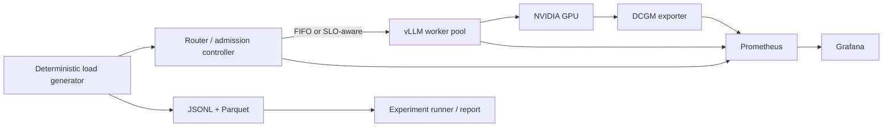

# servebench

Servebench is a production-style LLM inference laboratory for answering one question with data:

> When this server gets overloaded, exactly where does latency come from, what happens to the KV
> cache and GPU, and can an SLO-aware scheduling policy improve it?

The real deployment uses vLLM and an ungated `Qwen/Qwen2.5-7B-Instruct` default. Set `MODEL` to
change checkpoints without modifying code.

## Architecture



The router is OpenAI-compatible at `/v1/completions` and `/v1/chat/completions`. The SLO policy
uses assigned in-flight depth, vLLM's sampled waiting-request count, calibrated prompt tokens,
and KV pressure to admit, briefly delay, return an explicit HTTP 429, or select the
least-pressured worker. `ROUTER_POLICY=fifo` is the baseline;
`ROUTER_POLICY=slo` enables the controller.
SLO mode requires a recent sample containing both KV utilization and vLLM waiting requests. It
rejects conservatively when pressure telemetry has never arrived or is older than five seconds;
`servebench_worker_pressure_telemetry_fresh` exposes that state to Prometheus. FIFO remains
available even when pressure telemetry is unavailable.

For any network-accessible deployment, set a strong `ROUTER_API_KEY` and keep vLLM port 8000
private behind a firewall or reverse proxy. Only the read-only `web` service should be published at
`www.shivanknigam.com`; vLLM documents that its own API-key option does not protect every endpoint.

## Start and validate

Prerequisites for the real stack are Docker Compose, an NVIDIA GPU, NVIDIA Container Toolkit, and
enough VRAM for the selected model. Start it with:

```bash
MODEL=Qwen/Qwen2.5-7B-Instruct ROUTER_POLICY=fifo make serve
```

On a laptop or CI runner without a GPU, use the deterministic mock backend:

```bash
make smoke
```

The mock path verifies HTTP streaming, timing capture, routing, persistence, and observability. It
is not valid evidence about vLLM, KV cache, GPU saturation, or scheduler quality.

The read-only results service exposes `/api/runs`, `/api/status`, `/report`, and `/figures/*` for a
future themed frontend. Its status endpoint declares GPU evidence only when the run includes the
required vLLM queue/prefill, KV-cache, and DCGM utilization/memory telemetry. A partial result file
is omitted from `/api/runs` and counted in `invalid_result_files` instead of taking the site down.

Common commands:

```bash
make serve       # real vLLM + router + monitoring
make smoke       # mock backend and a small end-to-end load run
make loadtest    # mixed workload against ROUTER_URL
make sweep       # assemble transition-focused run summaries
make engine-sweep SATURATION_CONCURRENCY=32  # independent engine variants
make compare     # repeated FIFO/SLO comparison; override is enabled then restored safely
make report      # regenerate REPORT.md and figures
make site        # serve the read-only results site on port 8081
make test        # unit and integration tests
```

Override `REQUESTS`, `CONCURRENCY`, and `ROUTER_URL` for `make loadtest`. Engine experiments use
`MAX_BATCHED_TOKENS`, `MAX_SEQS`, `ROUTER_POLICY`, and the variants in
`experiments/baseline.yaml`. Quantized runs use the supported AWQ checkpoint configured as
`quantized_model`; they never silently quantize the BF16 checkpoint. Every engine candidate is
paired with a fresh repeated baseline, changes one setting, writes confidence intervals to
`decision.json`, and restores the baseline engine even if a run fails.

## Workloads and protocol

- `short`: 256 prompt tokens and 128 generated tokens.
- `long-prefill`: 4096 prompt tokens and 128 generated tokens.
- `shared-prefix`: an identical 3968-token prefix and a 128-token unique suffix.
- `bursty`: Poisson background arrivals plus an instantaneous request spike.
- `mixed`: deterministic weighted sampling of all workload classes.

Seeds are isolated from global random state. The load generator uses vLLM `/tokenize` to calibrate
prompt lengths to the active `MODEL`, and requests token IDs in streaming responses. ITL is the gap
between non-empty streamed output events; several token IDs in one event do not create artificial
zero-duration gaps. TPOT is `(completion time - first-token time) / (output tokens - 1)`. Set
`TOKENIZER_URL` if vLLM is on another host.
First sweep concurrency geometrically until throughput flattens and p95 TTFT turns sharply, then
refine around that transition. If no transition is measured, the report says so. Independently vary
max batched tokens, max sequences, prefix caching, chunked prefill, and BF16 versus AWQ. Run each
engine candidate at least three times and each scheduler policy four times, bootstrap paired
confidence intervals, and keep a scheduler change
only when p95 TTFT improves while throughput and completion rate stay at or above 95% of FIFO.
FIFO and SLO repeats use the same seeds and alternate execution order to reduce warm-cache/order
bias. Engine candidates restart vLLM before both the fresh baseline and candidate suite; manifests
record the model, complete engine settings, seed, execution order, and initial cache state.

## Measurements and raw data

Each request record contains scheduling, start, first-token, per-token, and completion timestamps;
actual and nominal token counts; client semaphore wait; router admission time; HTTP status/error;
chosen worker; and the router's KV snapshot. Prometheus collects run-level vLLM queue and prefill
latency, KV utilization, prefix hits, preemptions, and DCGM GPU utilization, memory, and power where
available. Client semaphore wait is outside TTFT; router admission time and post-header TTFT are
separate stages, while vLLM queue/pre-fill histogram means are run-level telemetry. Derived
summaries include p50/p95/p99 TTFT, stream-event inter-token latency, TPOT, end-to-end latency,
request and token throughput, rejections, timeouts, and failures. GPU conclusions require verified
vLLM and DCGM telemetry plus model/cache provenance; mock and incomplete GPU rows cannot support
optimization claims. A policy cannot win by rejecting hard requests: completion-rate confidence
intervals are a hard constraint alongside throughput.

Raw runs live under `results/<run-id>/requests.jsonl` and `results/<run-id>/requests.parquet` with a
`summary.json` and run manifest. Large raw results should be uploaded as release artifacts or object
storage and linked from the report. `BENCH_STATE.md` is the append-only hypothesis/decision ledger.

## Real-GPU acceptance checklist

Run this sequence on a Linux NVIDIA host after installing Docker, Compose, the NVIDIA Container
Toolkit, and `uv`. It is the remaining evidence step; the committed mock data only validates the
pipeline.

```bash
nvidia-smi
export MODEL=Qwen/Qwen2.5-7B-Instruct
docker compose up --build -d --wait
make sweep
cat results/baseline-saturation/transition.json
make engine-sweep SATURATION_CONCURRENCY=<measured transition concurrency>
make compare
make report
docker compose --profile tools down
```

Before accepting a result, confirm every candidate has at least three repeats, `evidence_kind` is
`gpu`, no required telemetry field is null, the comparison includes throughput and completion-rate
confidence intervals, and `REPORT.md` names the quantitative saturation bottleneck. Configure
`GPU_HOURLY_COST_USD` when generating the report to include cost per million output tokens.

## Key output graphs

- [Saturation curve](figures/saturation.png): concurrency against throughput and p95 TTFT.
- [Latency stages](figures/latency-decomposition.png): TTFT, router admission, and post-header TTFT
  where measured; older runs show client wait separately and are labeled legacy.
- [FIFO vs SLO scheduler](figures/scheduler-comparison.png): repeated policy comparison.

Grafana is available on port 3000, Prometheus on 9090, the router on 8080, and vLLM on 8000. These
operator ports bind to loopback by default. The `web` service is the only public bind; its generated
figures and `REPORT.md` are suitable for publishing on `www.shivanknigam.com`, and a themed
presentation layer can consume the same result schema later.
If port 3000 is occupied, set `GRAFANA_HOST_PORT=3001` for the Compose command.
