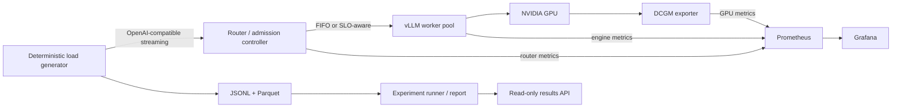

# servebench

Servebench is a reproducible laboratory for finding the point where an LLM inference service stops
behaving well—and explaining why. It puts a deterministic load generator, an SLO-aware admission
controller, [vLLM](https://docs.vllm.ai/en/v0.18.0/), Prometheus, Grafana, and NVIDIA's DCGM
exporter into one Docker Compose stack.

The project is built to answer a practical production question:

> When this server gets overloaded, exactly where does latency come from, what happens to the KV
> cache and GPU, and can an SLO-aware scheduling policy improve it?

The default model is the ungated, Apache-2.0-licensed
[`Qwen/Qwen2.5-7B-Instruct`](https://huggingface.co/Qwen/Qwen2.5-7B-Instruct), but the model is a
configuration value, not an architectural dependency. Set `MODEL` to use another checkpoint.

> **Evidence status:** the repository includes deterministic mock results and figures that prove the
> experiment pipeline works end to end. They are not GPU performance results. A real NVIDIA run is
> still required before claiming a saturation point, a vLLM bottleneck, or an improvement over FIFO.

## Contents

- [What Servebench measures](#what-servebench-measures)
- [Architecture](#architecture)
- [Quick start without a GPU](#quick-start-without-a-gpu)
- [Run the real GPU stack](#run-the-real-gpu-stack)
- [Workloads](#workloads)
- [Metrics and timing semantics](#metrics-and-timing-semantics)
- [FIFO and SLO-aware scheduling](#fifo-and-slo-aware-scheduling)
- [Experiment protocol](#experiment-protocol)
- [Results and evidence rules](#results-and-evidence-rules)
- [Operations and security](#operations-and-security)
- [Publishing the results site](#publishing-the-results-site)
- [Development and troubleshooting](#development-and-troubleshooting)
- [Reference documentation](#reference-documentation)

## What Servebench measures

Servebench treats overload as a transition to locate, not merely a high-concurrency benchmark. A
baseline sweep increases concurrency geometrically, looks for throughput flattening and a sharp
rise in p95 time to first token (TTFT), then refines around that region. Once the transition is
known, independent engine experiments vary one control at a time:

- maximum batched tokens;
- maximum concurrent sequences;
- prefix caching on or off;
- chunked prefill on or off; and
- BF16 versus an explicitly configured AWQ checkpoint.

This is intentionally not a giant grid search. The goal is to associate a change in user-visible
latency with queueing, prefill, KV-cache pressure, preemption, GPU utilization, memory, and power.
That distinction matters because vLLM documents KV-cache exhaustion as a cause of request
preemption and increased end-to-end latency. Its tuning guide also describes the central chunked
prefill tradeoff: smaller token budgets tend to favor inter-token latency, while larger budgets can
favor TTFT and prefill throughput. See vLLM's
[optimization and tuning guide](https://docs.vllm.ai/en/v0.18.0/configuration/optimization/).

Every run produces request-level JSONL and Parquet plus an aggregate summary. Repeated optimization
comparisons add provenance, paired confidence intervals, decision records, and publication figures.
`BENCH_STATE.md` is the append-only scientific notebook: baseline, bottleneck, hypothesis,
one-variable change, result, and keep/revert decision.

## Architecture



The request path is deliberately small:

1. The load generator creates seeded requests, calibrates their prompts through vLLM's `/tokenize`
   endpoint, and sends streamed completion requests.
2. The router accepts `/v1/completions` and `/v1/chat/completions`, applies either FIFO or the
   SLO-aware policy, and proxies the request to a vLLM worker.
3. The router samples each worker's vLLM metrics once per second and exposes its own decisions and
   pressure state to Prometheus.
4. Prometheus scrapes the router, vLLM, and DCGM exporter. Grafana is provisioned from the files in
   `configs/grafana/provisioning/` and `dashboards/`.
5. The experiment runner joins request measurements with run-scoped telemetry and writes artifacts
   beneath `results/`.

vLLM itself provides an
[OpenAI-compatible HTTP server](https://docs.vllm.ai/en/v0.18.0/serving/openai_compatible_server/).
Prometheus uses the standard pull model—scraping HTTP metric endpoints at configured intervals—as
described in its [getting-started guide](https://prometheus.io/docs/prometheus/latest/getting_started/).
Grafana's checked-in configuration follows its supported
[provisioning-as-code model](https://grafana.com/docs/grafana/latest/administration/provisioning/),
so dashboards and data sources do not have to be recreated by hand.

### Repository layout

```text
src/router/          OpenAI-compatible router, worker state, and policies
src/loadgen/         Streaming client and tokenizer calibration
src/metrics/         Prometheus instrumentation
src/experiments/     Saturation, engine, scheduler, and telemetry runners
src/servebench/      Workloads, result schema, statistics, and report generation
src/webapp/          Theme-neutral, read-only results API and HTML shell
configs/             Runtime, Prometheus, and Grafana configuration
dashboards/          Provisioned Grafana dashboard
experiments/         Versioned experiment definitions
results/             Machine-readable run artifacts
figures/             Generated publication figures
tests/               Unit, integration, and deployment-contract tests
```

## Quick start without a GPU

The smoke stack is the fastest way to validate a checkout on a laptop or CI runner. It replaces
vLLM with a deterministic mock backend but keeps the router, streaming client, Prometheus, Grafana,
and persistence path.

Prerequisites are Docker with the Compose plugin and `make`.

```bash
git clone https://github.com/stannum13/servebench.git
cd servebench
make smoke
```

The command builds the local images, waits for healthy services, sends eight short requests at
concurrency two, and writes:

```text
results/smoke/requests.jsonl
results/smoke/requests.parquet
results/smoke/summary.json
```

Useful checks after the run:

```bash
curl -fsS http://localhost:8080/healthz
curl -fsS http://localhost:9090/-/healthy
cat results/smoke/summary.json
```

The mock run validates HTTP streaming, timing collection, routing, metric scraping, and artifact
serialization. It cannot validate CUDA execution, KV-cache behavior, GPU saturation, real prefix
reuse, or scheduler quality. Keeping that boundary explicit prevents a polished demo from being
mistaken for benchmark evidence.

Stop the smoke stack with:

```bash
docker compose -f docker-compose.yml -f docker-compose.smoke.yml down
```

## Run the real GPU stack

### Prerequisites

Use a Linux host with:

- a supported NVIDIA GPU and driver;
- Docker Engine and the Compose plugin;
- NVIDIA Container Toolkit;
- enough GPU memory for the selected model and engine settings; and
- [`uv`](https://docs.astral.sh/uv/) for host-side experiment commands.

Docker Compose exposes GPUs through device reservations; `capabilities: [gpu]` is required by
Docker's [Compose GPU support](https://docs.docker.com/compose/how-tos/gpu-support/). NVIDIA's
[Container Toolkit installation guide](https://docs.nvidia.com/datacenter/cloud-native/container-toolkit/install-guide.html)
also requires an installed NVIDIA driver and documents configuring Docker with
`nvidia-ctk runtime configure --runtime=docker` followed by a Docker restart.

Verify the host before downloading model weights:

```bash
nvidia-smi
docker compose config --quiet
uv sync --extra dev
```

### Start serving

```bash
export MODEL=Qwen/Qwen2.5-7B-Instruct
export ROUTER_POLICY=fifo
export ROUTER_API_KEY='replace-with-a-long-random-secret'
make serve
```

The Compose file pins vLLM to `v0.18.0`. It starts with prefix caching and chunked prefill enabled,
`MAX_BATCHED_TOKENS=8192`, `MAX_SEQS=256`, and `DTYPE=bfloat16` unless overridden. Model weights are
stored in the named `hf-cache` volume. Docker Compose waits for vLLM's health check before starting
the router; this uses Compose's documented
[health-based dependency ordering](https://docs.docker.com/compose/how-tos/startup-order/).

In another shell, include the same router key when running the client:

```bash
export ROUTER_API_KEY='replace-with-a-long-random-secret'
make loadtest REQUESTS=100 CONCURRENCY=8
```

To use another model, change the environment rather than the source:

```bash
MODEL=your-org/your-model make serve
```

The checked-in Compose file does not pass a Hugging Face token into vLLM because the default model
is ungated. For a gated checkpoint, add a secret-backed token mapping for the vLLM service; do not
place the token in Compose YAML or commit it to `.env`. Quantized engine experiments do not silently
quantize `MODEL`; they use the explicit `quantized_model` in `experiments/baseline.yaml`.

### Service endpoints

| Service | Default URL | Exposure |
| --- | --- | --- |
| Router | `http://127.0.0.1:8080` | loopback |
| vLLM | `http://127.0.0.1:8000` | loopback |
| Prometheus | `http://127.0.0.1:9090` | loopback |
| Grafana | `http://127.0.0.1:3000` | loopback |
| DCGM exporter | `http://127.0.0.1:9400/metrics` | loopback |
| Results site | `http://localhost:8081` | all interfaces when started |

If port 3000 is occupied, set `GRAFANA_HOST_PORT=3001` on the Compose or `make serve` command.

## Workloads

All workload generation is deterministic for a given seed. The default seed is `20260914`; use the
load generator's `--seed` option for a direct run or edit the experiment YAML for a suite. Prompt
lengths are targets, then calibrated to exact token counts against the active model tokenizer when
`TOKENIZER_URL` or `--tokenizer-url` enables tokenizer preflight.

| Class | Shape | Purpose |
| --- | --- | --- |
| `short` | 256 prompt / 128 generated tokens | decode-oriented interactive traffic |
| `long-prefill` | 4,096 prompt / 128 generated tokens | stresses prefill and queue interference |
| `shared-prefix` | 3,968 common + 128 unique prompt tokens / 128 generated | measures prefix-cache reuse |
| `bursty` | 256 prompt / 128 generated; Poisson background plus a midpoint spike when a request rate is set | exercises transient overload |
| `mixed` | 40% short, 20% long-prefill, 20% shared-prefix, 20% bursty | policy optimization workload |

With a positive `--request-rate`, the arrival process is open-loop: background inter-arrival times
are exponentially distributed, while the burst injects simultaneous arrivals. With the default
rate of zero, requests are submitted immediately and concurrency is bounded by the client
semaphore. In both modes, Servebench records semaphore wait separately from TTFT. Experiment YAML
can set `request_rate` to exercise the open-loop path.

## Metrics and timing semantics

The terms below are easy to conflate, so Servebench records timestamps rather than reconstructing
all latency from one aggregate number.

| Measurement | Definition in Servebench |
| --- | --- |
| Client queue time | scheduled arrival to acquisition of the load-generator semaphore; outside TTFT |
| Router admission | authentication, policy action, optional delay, and worker reservation |
| Post-header TTFT | response headers received to first non-empty streamed token event |
| TTFT | request start to first non-empty streamed token event |
| Inter-token latency (ITL) | gap between consecutive non-empty streamed output events |
| Time per output token (TPOT) | `(completion - first token) / (output tokens - 1)` |
| End-to-end latency | request start to stream completion |

The event-based ITL definition is intentional. A server-sent event may contain several token IDs;
Servebench counts the event once instead of manufacturing zero-length gaps between tokens that
arrived together. This matches vLLM's own benchmark guidance: TTFT runs from request submission to
first output, ITL measures gaps between streamed outputs, and TPOT averages post-first-token time
over the remaining output tokens. See the official
[vLLM benchmark metric definitions](https://docs.vllm.ai/en/latest/benchmarking/cli/).

Every client summary includes p50/p95/p99 TTFT, ITL, TPOT, and end-to-end latency plus request and
token throughput and outcome counts. Experiment-suite runs also join Prometheus telemetry when a
Prometheus URL is configured, adding:

- vLLM queue, prefill, decode, and TTFT telemetry;
- KV-cache utilization, prefix-cache hit rate, and preemptions; and
- GPU utilization, framebuffer memory, and power where the hardware exposes them.

The engine metric names come from vLLM's
[production metrics reference](https://docs.vllm.ai/en/v0.18.0/usage/metrics/), including
`vllm:kv_cache_usage_perc`, `vllm:num_requests_waiting`, request queue/prefill/decode histograms,
prefix-cache counters, and preemptions. DCGM availability is hardware- and deployment-dependent;
NVIDIA's [exported metrics reference](https://docs.nvidia.com/datacenter/dcgm/latest/reference/dcgm-exporter-metrics.html)
documents utilization, framebuffer-memory, and power fields and notes that field support can vary
by GPU, driver, permissions, and environment.

## FIFO and SLO-aware scheduling

`ROUTER_POLICY=fifo` is the project's named control. With one worker it delegates queue ordering to
vLLM without policy-driven delay; with multiple workers it selects the worker with the smallest
assigned in-flight depth, so it is not a single global FIFO queue. It does not require pressure
telemetry.

`ROUTER_POLICY=slo` is an understandable rules-based controller. For each request it considers:

- prompt length, calibrated exactly when tokenizer preflight is enabled;
- router-assigned in-flight depth;
- vLLM's sampled waiting-request count; and
- current KV-cache utilization.

The policy then admits immediately, delays briefly, rejects with HTTP 429 and `Retry-After: 1`, or
selects a less-pressured worker. Defaults in `configs/default.yaml` are a 1,000 ms TTFT target,
128-request queue limit, 2,048-token long-prompt cutoff, 80% KV soft limit, 95% KV hard limit, and
250 ms maximum delay.

SLO mode fails closed if no worker has a recent sample containing both KV usage and vLLM waiting
requests. Telemetry older than five seconds is stale. The Prometheus gauge
`servebench_worker_pressure_telemetry_fresh` makes this visible. FIFO remains usable during a
telemetry outage.

The Python configuration accepts comma-separated worker URLs in `VLLM_BASE_URL`; the controller
chooses the lowest pressure score, with stable worker-name tie-breaking. The checked-in Compose file
sets that variable to its single `vllm` service, so alternate-worker routing requires extending the
Compose topology or running the router with a separate configuration.

## Experiment protocol

### 1. Locate saturation

```bash
make sweep
cat results/baseline-saturation/transition.json
```

`experiments/baseline.yaml` starts at concurrency 1 and proceeds through 2, 4, 8, 16, 32, 64, and
128. It performs three repeats and refines around an observed transition. If the data do not show a
transition, the report says so rather than selecting one by eye.

### 2. Change one engine control

Use the measured transition concurrency:

```bash
make engine-sweep SATURATION_CONCURRENCY=32
```

Each candidate is paired with a fresh repeated baseline, changes one engine setting, restarts vLLM
to isolate engine/cache state, and writes a `decision.json` with confidence intervals. The runner
restores the baseline engine even when a candidate fails.

One vLLM constraint deserves attention before launching the checked-in sweep: with chunked prefill
disabled, vLLM requires `max_num_batched_tokens` to be compatible with the model's maximum sequence
length. The default Qwen context is larger than the baseline value of 8,192, so validate or adjust
that candidate for the selected model first; otherwise vLLM can reject the engine configuration and
the sweep will stop. This requirement is documented in vLLM's
[optimization guide](https://docs.vllm.ai/en/v0.18.0/configuration/optimization/).

### 3. Compare scheduling policies

```bash
make compare
```

FIFO and SLO use the same seeds and alternate execution order to reduce warm-cache and ordering
bias. There are four repeats per policy. A policy is eligible to win only if:

- its paired p95 TTFT confidence interval shows an improvement;
- throughput is at least 95% of FIFO;
- the completion-rate confidence interval shows no regression from FIFO;
- every expected request completed successfully, with no rejection, timeout, or failure; and
- both policies carry verified GPU evidence.

This prevents a scheduler from “improving” latency by rejecting the difficult requests.

### 4. Regenerate the report

```bash
make report
```

Set `GPU_HOURLY_COST_USD` before report generation to include estimated cost per million output
tokens. A cost figure is meaningful only when it matches the actual GPU and billing basis.

### Common commands

```bash
make serve       # start the real vLLM, router, and monitoring stack
make smoke       # run the deterministic no-GPU integration path
make loadtest    # run one mixed workload against ROUTER_URL
make sweep       # locate the saturation transition
make engine-sweep SATURATION_CONCURRENCY=32
make compare     # repeated FIFO-versus-SLO experiment
make report      # rebuild REPORT.md and the three figures
make site        # start the read-only results service on port 8081
make test        # run unit, integration, and contract tests
```

`REQUESTS`, `CONCURRENCY`, `ROUTER_URL`, `TOKENIZER_URL`, and `PROMETHEUS_URL` are available for
non-default topologies. Engine controls include `MAX_BATCHED_TOKENS`, `MAX_SEQS`, `DTYPE`,
`PREFIX_CACHE_FLAG`, and `CHUNKED_PREFILL_FLAG`.

## Results and evidence rules

A normal load run writes:

```text
results/<run-id>/
├── requests.jsonl
├── requests.parquet
└── summary.json
```

Sweep directories additionally contain `runs.json`, transition or comparison output, and decision
records. Provenance is embedded in the run rows and comparison output. The request schema includes
scheduled, start, header, first-token, stream-event, and completion timestamps; nominal and observed
token counts; policy and selected worker; router admission; HTTP outcome; and the router's KV
snapshot.

The three publication figures are:

- [Saturation curve](figures/saturation.png) — concurrency versus throughput and p95 TTFT.
- [Latency decomposition](figures/latency-decomposition.png) — client wait, router admission, and
  post-header TTFT when those stages are available.
- [FIFO versus SLO](figures/scheduler-comparison.png) — repeated scheduler comparison.

The generated narrative lives in [REPORT.md](REPORT.md). Large raw GPU results should be attached
to a GitHub release or durable object storage and linked from the report; small metadata and summary
files can remain in Git.

### Real-GPU acceptance checklist

```bash
nvidia-smi
export MODEL=Qwen/Qwen2.5-7B-Instruct
docker compose up --build -d --wait
make sweep
cat results/baseline-saturation/transition.json
export SATURATION_CONCURRENCY=32  # replace 32 with transition.json's measured value
make engine-sweep
make compare
make report
docker compose --profile tools down
```

Before publishing a claim, verify that:

- every engine candidate has at least three repeats and each policy has four;
- `evidence_kind` is `gpu`;
- required vLLM queue/prefill, KV, GPU utilization, and GPU memory fields are present;
- run provenance identifies the model, seed, execution order, and initial cache state; engine
  comparisons additionally identify their complete engine settings;
- throughput and completion-rate confidence intervals accompany latency intervals;
- no run used for a keep decision contains a rejection, timeout, or failure; and
- `REPORT.md` explains the saturation bottleneck quantitatively.

The vLLM benchmark documentation warns that repeated runs can reuse prefix-cache entries. Servebench
therefore records cache provenance and restarts vLLM around engine comparisons; see vLLM's
[benchmark CLI notes](https://docs.vllm.ai/en/latest/benchmarking/cli/) for the underlying concern.

## Operations and security

The Compose stack is a production-style benchmark environment, not a complete public inference
platform. Before placing it on an untrusted network:

1. Set a strong `ROUTER_API_KEY`. The router uses constant-time bearer-token comparison on its two
   inference endpoints.
2. Keep vLLM, Prometheus, Grafana, and DCGM bound to loopback or a private network. The checked-in
   Compose file already binds these host ports to `127.0.0.1`.
3. Do not rely on vLLM's API key as a perimeter. vLLM explicitly states that its key protects only
   selected API paths and recommends exposing the smallest possible network surface; read its
   [security guidance](https://docs.vllm.ai/en/v0.18.0/usage/security/).
4. Put any public endpoint behind a maintained reverse proxy or ingress with TLS, request-size and
   rate limits, timeouts, logging, and the access policy appropriate for the deployment.
5. Treat prompts, completions, API keys, Hugging Face tokens, and raw request artifacts as sensitive.
   Never commit secrets; start from `.env.example` and use the deployment platform's secret store.
6. Restrict dashboard administration. The bundled Grafana instance is convenient for a single-host
   lab; a durable multi-user production deployment should use persistent storage, authentication,
   and an external database according to Grafana's
   [installation guidance](https://grafana.com/docs/grafana/latest/setup-grafana/installation/).

`ALLOW_POLICY_OVERRIDE` is disabled by default because `X-Servebench-Policy` is an experimental
control, not a public API feature. `make compare` enables it only for the comparison and restores the
router with overrides disabled on exit.

## Publishing the results site

`make site` starts a theme-neutral FastAPI service that exposes:

| Path | Purpose |
| --- | --- |
| `/` | minimal HTML status page |
| `/api/runs` | machine-readable run summaries |
| `/api/status` | evidence availability and invalid-file count |
| `/report` | current report as plain text |
| `/figures/*` | generated graph assets |
| `/healthz` | liveness check |

The API is designed to sit behind a separately themed frontend for `www.shivanknigam.com`. It is
read-only and tolerates malformed result files by omitting them and incrementing
`invalid_result_files`. It declares `gpu_evidence: true` only when a run is marked as GPU evidence
and includes valid KV, vLLM queue/prefill, GPU utilization, and GPU memory values.

The current `web` port publishes on all host interfaces and the service has no built-in user
authentication, TLS termination, cache policy, or rate limiting. Do not point public DNS directly at
port 8081. A production deployment should place it behind the site's existing CDN/reverse proxy,
terminate HTTPS there, restrict origin access, and publish only the routes intended for readers.

## Development and troubleshooting

### Local checks

```bash
uv sync --extra dev
uv run --extra dev pytest -q
uv run --extra dev ruff check .
docker compose config --quiet
```

### vLLM never becomes healthy

Check GPU visibility and container logs:

```bash
nvidia-smi
docker compose logs vllm
docker compose exec vllm nvidia-smi
```

Common causes are an unconfigured NVIDIA runtime, incompatible driver/container CUDA versions,
insufficient VRAM, a gated or misspelled checkpoint, or missing registry credentials. vLLM publishes
an official `vllm/vllm-openai` image and documents its GPU container invocation in the
[GPU installation guide](https://docs.vllm.ai/en/v0.18.0/getting_started/installation/gpu/).

### DCGM fields are missing

```bash
docker compose logs dcgm-exporter
curl -fsS http://127.0.0.1:9400/metrics | grep '^DCGM_FI_DEV_'
```

Not every GPU or environment exposes every DCGM field. Power, for example, may be unavailable even
when utilization and memory are present. Servebench records unavailable values as missing and does
not fabricate them.

### Grafana's port is already in use

```bash
GRAFANA_HOST_PORT=3001 make serve
```

### The SLO policy returns 429 immediately

```bash
curl -fsS http://127.0.0.1:8080/metrics | grep servebench_worker_pressure
curl -fsS http://127.0.0.1:8000/metrics | grep 'vllm:'
```

This is expected fail-closed behavior when KV usage or the backend waiting count has never been
sampled, is stale, or exceeds the configured hard limit. Use FIFO only as a diagnostic; do not label
that fallback an SLO-policy result.

### Clean shutdown

```bash
docker compose --profile tools down
```

The named Hugging Face cache volume is preserved. Add `--volumes` only when you intentionally want
to delete downloaded model data.

## Reference documentation

The implementation and terminology are grounded in the following primary sources:

- vLLM: [production metrics](https://docs.vllm.ai/en/v0.18.0/usage/metrics/),
  [optimization and tuning](https://docs.vllm.ai/en/v0.18.0/configuration/optimization/),
  [benchmark CLI and metric definitions](https://docs.vllm.ai/en/latest/benchmarking/cli/),
  [OpenAI-compatible server](https://docs.vllm.ai/en/v0.18.0/serving/openai_compatible_server/), and
  [security](https://docs.vllm.ai/en/v0.18.0/usage/security/).
- Docker: [Compose GPU support](https://docs.docker.com/compose/how-tos/gpu-support/) and
  [startup ordering](https://docs.docker.com/compose/how-tos/startup-order/).
- NVIDIA: [Container Toolkit installation](https://docs.nvidia.com/datacenter/cloud-native/container-toolkit/install-guide.html)
  and [DCGM exporter metrics](https://docs.nvidia.com/datacenter/dcgm/latest/reference/dcgm-exporter-metrics.html).
- Observability: [Prometheus getting started](https://prometheus.io/docs/prometheus/latest/getting_started/)
  and [Grafana provisioning](https://grafana.com/docs/grafana/latest/administration/provisioning/).
- Default model: [Qwen2.5-7B-Instruct model card](https://huggingface.co/Qwen/Qwen2.5-7B-Instruct).

When reporting results, cite the Servebench commit, model revision, GPU and driver, vLLM version,
experiment YAML, seed, and raw artifact location. Those details are part of the result—not optional
setup trivia.
