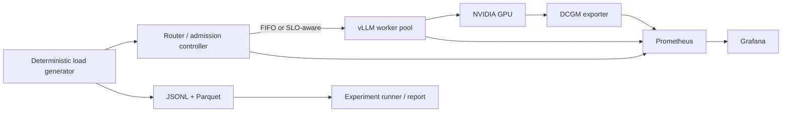

# servebench

Servebench is a production-style LLM inference laboratory for answering one question with data:

> When this server gets overloaded, exactly where does latency come from, what happens to the KV
> cache and GPU, and can an SLO-aware scheduling policy improve it?

The real deployment uses vLLM and an ungated `Qwen/Qwen2.5-7B-Instruct` default. Set `MODEL` to
change checkpoints without modifying code.

## Architecture



The router is OpenAI-compatible at `/v1/completions` and `/v1/chat/completions`. The SLO policy
uses queue depth, estimated prompt tokens, and KV pressure to admit, briefly delay, return an
explicit HTTP 429, or select the least-pressured worker. `ROUTER_POLICY=fifo` is the baseline;
`ROUTER_POLICY=slo` enables the controller.

## Start and validate

Prerequisites for the real stack are Docker Compose, an NVIDIA GPU, NVIDIA Container Toolkit, and
enough VRAM for the selected model. Start it with:

```bash
MODEL=Qwen/Qwen2.5-7B-Instruct ROUTER_POLICY=fifo make serve
```

On a laptop or CI runner without a GPU, use the deterministic mock backend:

```bash
make smoke
```

The mock path verifies HTTP streaming, timing capture, routing, persistence, and observability. It
is not valid evidence about vLLM, KV cache, GPU saturation, or scheduler quality.

Common commands:

```bash
make serve       # real vLLM + router + monitoring
make smoke       # mock backend and a small end-to-end load run
make loadtest    # mixed workload against ROUTER_URL
make sweep       # assemble transition-focused run summaries
make report      # regenerate REPORT.md and figures
make test        # unit and integration tests
```

Override `REQUESTS`, `CONCURRENCY`, and `ROUTER_URL` for `make loadtest`. Engine experiments use
`MAX_BATCHED_TOKENS`, `MAX_SEQS`, `ROUTER_POLICY`, and the variants in
`experiments/baseline.yaml`. Quantized runs use one supported AWQ checkpoint supplied via `MODEL`;
they must not silently quantize the BF16 checkpoint.

## Workloads and protocol

- `short`: approximately 256 prompt tokens and 128 generated tokens.
- `long-prefill`: approximately 4096 prompt tokens and 128 generated tokens.
- `shared-prefix`: a byte-identical 3968-token prefix and a unique suffix.
- `bursty`: Poisson background arrivals plus an instantaneous request spike.
- `mixed`: deterministic weighted sampling of all workload classes.

Seeds are isolated from global random state. First sweep concurrency geometrically until throughput
flattens or p95 TTFT/queue time turns sharply, then refine around that transition. Independently vary
max batched tokens, max sequences, prefix caching, chunked prefill, and BF16 versus AWQ. Run each
candidate at least three times, bootstrap paired confidence intervals, and keep a scheduler change
only when p95 TTFT improves while throughput stays at or above 95% of FIFO.

## Measurements and raw data

Each request record contains scheduling, start, first-token, per-token, and completion timestamps;
token counts; queue time; status/error; chosen worker; and optional KV, prefix-cache, preemption,
GPU utilization, memory, and power snapshots. Derived summaries include p50/p95/p99 TTFT,
inter-token latency, end-to-end latency, queue time, request and token throughput, and failures.

Raw runs live under `results/<run-id>/requests.jsonl` and `results/<run-id>/requests.parquet` with a
`summary.json` and run manifest. Large raw results should be uploaded as release artifacts or object
storage and linked from the report. `BENCH_STATE.md` is the append-only hypothesis/decision ledger.

## Key output graphs

- [Saturation curve](figures/saturation.png): concurrency against throughput and p95 TTFT.
- [Latency decomposition](figures/latency-decomposition.png): TTFT against queue contribution.
- [FIFO vs SLO scheduler](figures/scheduler-comparison.png): repeated policy comparison.

Grafana is available on port 3000, Prometheus on 9090, the router on 8080, and vLLM on 8000. The
generated figures and `REPORT.md` are static deployable artifacts suitable for publishing on
`www.shivanknigam.com`; a themed presentation layer can consume the same result schema later.

