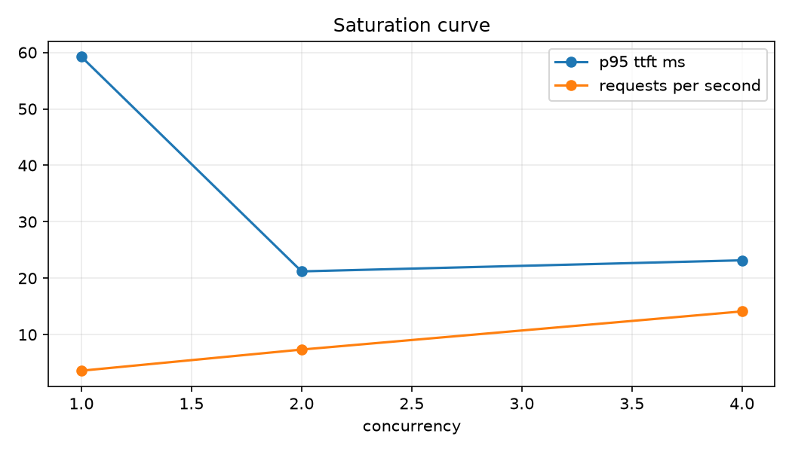
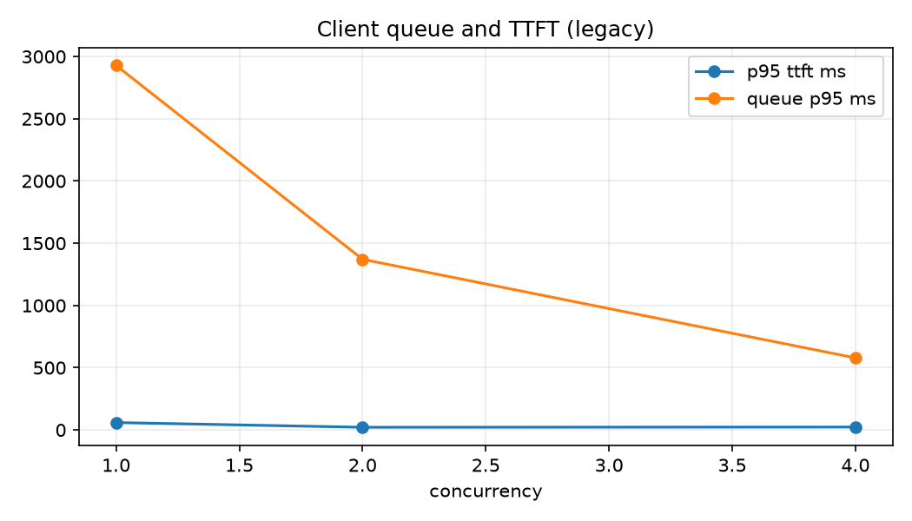
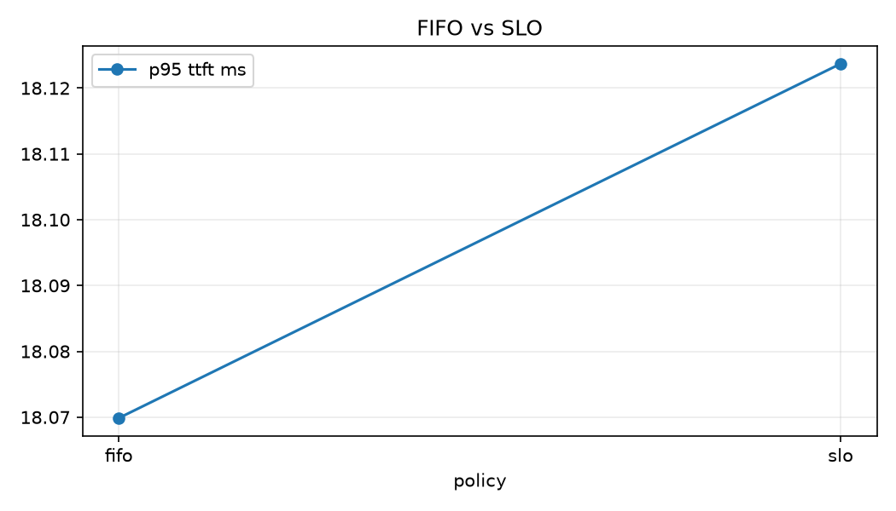

# Servebench Report

> Generated from machine-readable measurements. Smoke/mock results are not GPU evidence.

## Latency / throughput / cost

| policy | p95 TTFT ms (95% CI) | requests/s (95% CI) | completion % | rejection % | power (W) | $ / 1M output tokens |
|---|---:|---:|---:|---:|---:|---:|
| fifo | 18.07 [15.83, 20.89] | 14.13 [13.79, 14.54] | 100.00 | 0.00 | unavailable | not configured |
| slo | 18.12 [17.17, 19.08] | 14.02 [13.73, 14.33] | 100.00 | 0.00 | unavailable | not configured |

Mock evidence only: repeated measurements exist, but no optimization claim is made.

ITL is measured between non-empty streamed output events; it is stream-event ITL,
not a fabricated per-token gap when one event contains multiple token IDs. TPOT is
the elapsed time after the first token divided by the remaining output-token count.

## Key graphs

Client queue is loadgen semaphore wait and is outside TTFT. Router admission is measured inside the router; post-header TTFT includes backend queue, prefill, and transport. Run-scoped vLLM queue and prefill means are unavailable and unavailable, respectively. These p95 stage percentiles are not additive.

Queue growth, KV-cache pressure, and GPU utilization must be interpreted together
to locate saturation.
